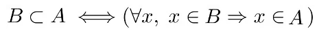
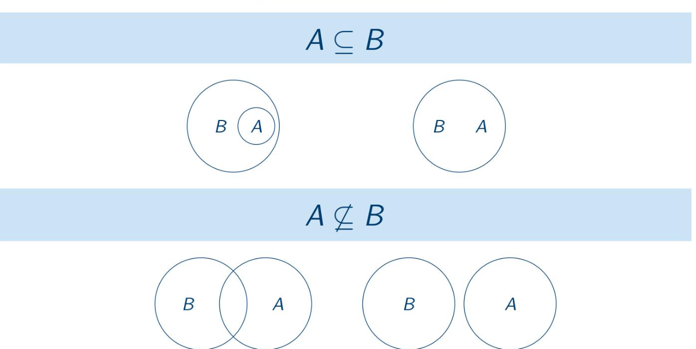

# Teoria dos conjuntos

## introdução
**conjunto** é uma coleção de zero ou mais elementos destintos que nao possue qualquer ordem associada.
em informatica, a teoria dos conjuntos pode ser utilizada na mais diversas atividades, como na contruçao de algebra booleana, banco de dados, representaçao de topologia de redes de computadores.

### conjuntos finitos e infinitos
conjuntos podem ser finitos, o que a gente consegue contar, exemplo conjuto de livro da biblioteca.
ou infito conjuto dos numeros natuais, nao da pra contar.

## Notação

Podemos listar um conjunto por extensão, entre chaves e separando os elementos por vírgula.

Por exemplo:
- A = {organizar, armazenar, informações}

Como podemos ver, geralmente indicamos um conjunto com uma letra maiúscula. Para indicar a pertinência de um elemento em um conjunto, usamos "&isin;" (ou "&#8712;"), e "&notin;" (ou "&#8713;") para não pertinência.

Por exemplo:
- organizar &isin; A
- representar &notin; A

## Subconjuntos
Dados os conjuntos A e B, dizemos que B é **subconjunto** de A se todos os elementos de B tambem forem elementos de A. nesse caso temos:

podemos ler essa definiçao da seguinte forma: B é subconjunto de A se, e somente se, para todo x, se x pertence ao conjunto A, entao x pertence ao conjunto B.

## diagrama de venn
um forma visual para se representar os conjuntos.

### conjunto universo:

basicamente tds os elemtentos

# operaçoes sobre conjuntos

### cardinalidade de conjuntos
um conjunto é dito contável se for correspondente a alguma sequencia.

- os elementos do conjunto porem ser arranjados em uma lista ordenada, a qual pode ser contada.
- tds os conjuntos finitos sao contaveis.
- um conjunto que nao é contavel e dito incontavel kkkkkkkkkkkkkkk

### emparelhamento
para que dois conjuntos X e Y possuam a **mesma cardinalidade**:
- **emparelhamento de cada x em X com apenas um y em Y
- cada elemento de Y seja apenas uma vez neste emparelhamento

### produto cartesiano

o produto cartesiano de dois conjuntos A e B é o conjunto de todos os pares ordenados(a,b) onde a E A e b E B, ou seja:
