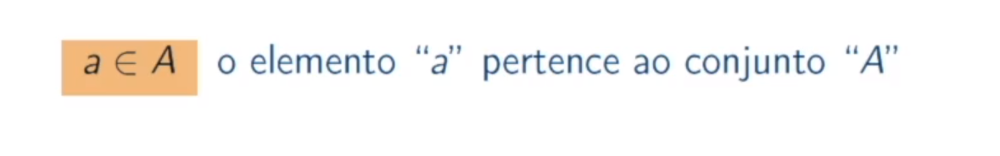
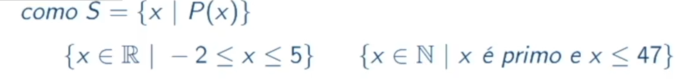
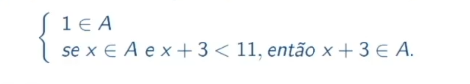
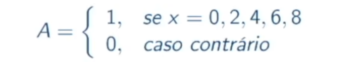

# Teoria dos conjuntos

**conjunto**: coleçao "bem-definida"(e nao ordenada) de objetos.
**elementos**: cada objeto do conjunto é denominado de lemento ou membro.
**notaçao**: letras **maiúsculas** sao, em geral usadas para denotar conjuntos e **minusculas** para denotar elementos destes conjuntos

## exemplo de notaçao

conjuntos podem ser finitos, o que a gente consegue contar, exemplo conjuto de livro da biblioteca.
ou infito conjuto dos numeros natuais, nao da pra contar.

### Formas para definir conjuntos
**Chaves** Listar os elementos do conjunto entre chaves.
{ovo, carne, marcarrao}
{1,2,3...50}

**Propriedade** especificar uma propriedade para definir um conjunto

**Recursão** especificar um conjunto por meio d euma funcao recursiva

**Caracteristica** espeficicar por meio de uma funcao caracteristica

## Subconjuntos
Dados os conjuntos A e B, dizemos que B é **subconjunto** de A se todos os elementos de B tambem forem elementos de A. nesse caso temos:

podemos ler essa definiçao da seguinte forma: B é subconjunto de A se, e somente se, para todo x, se x pertence ao conjunto A, entao x pertence ao conjunto B.

## diagrama de venn
um forma visual para se representar os conjuntos.

